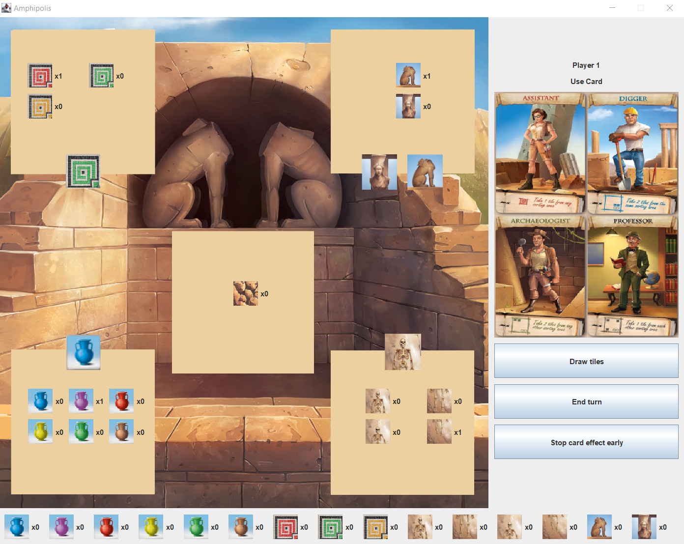

# Amphipolis
A board game about treasure hunting in the remains of Amphipolis. Built using Java with the MVP architecture

#### Note
You can find the javadoc for the project under the "/javadoc" dir, the project's UML diagrams under the "/diagrams' dir and the runnable .jar file under the "/JAR" dir. To run the .jar file simply run "java -jar XXXX.jar" from the directory. The project also includes a report for the project (in greek), analyzing goals, difficulties, MVP benefits, brainstorming, diagrams, OOP principles and more.
